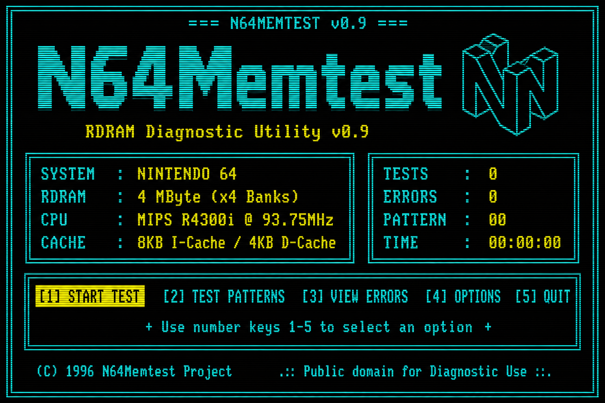
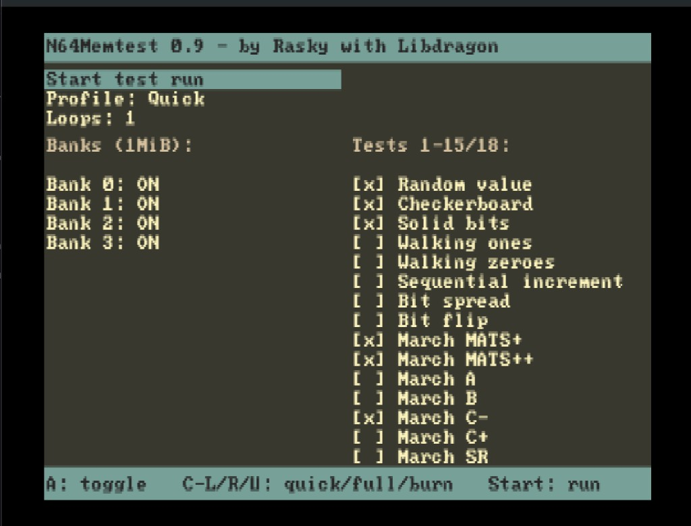
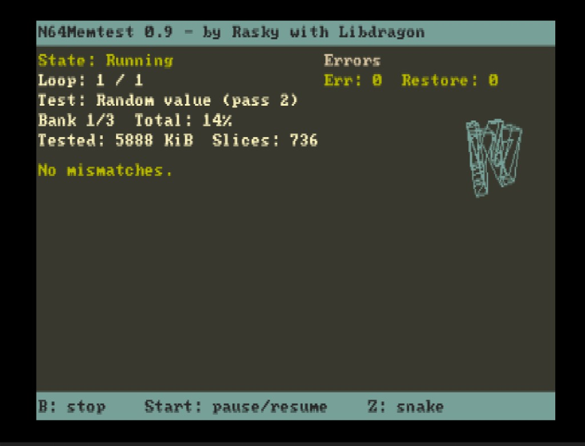
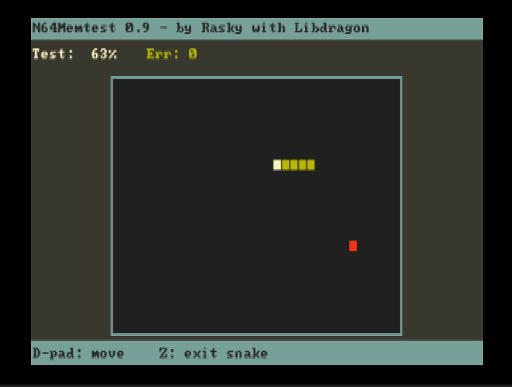

# N64Memtest



**N64Memtest** is a homebrew memory diagnostic tool for the Nintendo 64. It exercises RDRAM with a suite of classic RAM test patterns and March algorithms, reports mismatches with bank/address details, and keeps the UI responsive while tests run in hand-written MIPS assembly.

Built with [Libdragon](https://github.com/DragonMinded/libdragon).

<p align="center">
  <a href="docs/screenshots/setup.png"></a>
  <a href="docs/screenshots/running.png"></a>
  <a href="docs/screenshots/snake.png"></a>
</p>

## Features

- **18 memory test patterns**, including:
  - Random value, checkerboard, solid bits
  - Walking ones / walking zeroes
  - Sequential increment, bit spread, bit flip
  - March MATS+, MATS++, A, B, C-, C+, SR, SS, X, Y
- **Four test profiles**
  - **Quick** — fast sanity check (random, checkerboard, solid bits, selected March tests)
  - **Full** — comprehensive coverage (all March tests, walking patterns, bit flip, random)
  - **Burn-in** — continuous stress run (Full plus every remaining pattern; infinite loops)
  - **Custom** — pick banks and tests individually
- **Configurable loop count** — 1, 5, 20, or infinite (Burn-in always runs continuously)
- **Real-time UI** — progress percentage, KiB tested, slice count, error log with address/expected/actual values
- **Pause / resume / stop** controls during a run
- **Snake easter egg** — play while waiting for long burn-in sessions
- **Headless burn-in mode** — if no controller is connected on port 1, the tool auto-starts a burn-in run (useful for unattended testing)
- **iQue Player support** — detects iQue hardware and tests the 16 MiB physical RAM window correctly
- **Debug logging** — structured log messages over emulator log and USB debug

## Building

### Requirements

- A working [Libdragon](https://github.com/DragonMinded/libdragon) installation

### Build

```bash
make
```

This produces `n64memtest.z64`, ready to load on real hardware (flash cart, 64Drive, EverDrive, etc.) or in an emulator.

## License

Public domain — see [LICENSE.md](LICENSE.md) (Unlicense).
